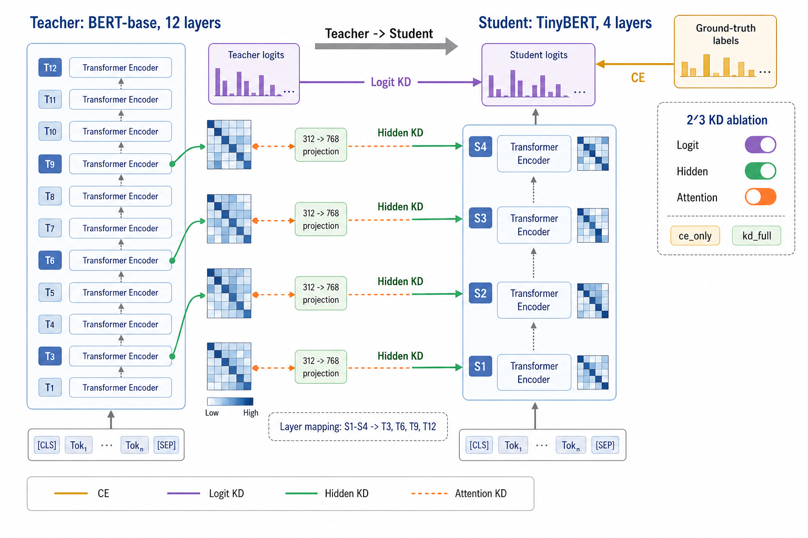

# TinyBERT-Ablation
  

TinyBERT-Ablation is a KAIST CS50700 Deep Learning final project that replicates and
extends TinyBERT's task distillation with granular control over knowledge
distillation (KD) loss components.

- **Logit KD**: match teacher output distributions.
- **Hidden KD**: match selected teacher hidden states through learned projections.
- **Attention KD**: match teacher attention probabilities.

Each run writes structured metadata, evaluation metrics, and loss magnitudes so
the ablation can be analyzed reproducibly.

## Table of Contents

- [1. Datasets](#1-datasets)
- [2. Features](#2-features)
- [3. Getting Started](#3-getting-started)
    - [3.1. Environment Setup](#31-environment-setup)
    - [3.2. Teacher Fine-Tuning](#32-teacher-fine-tuning)
    - [3.3. Student Distillation](#33-student-distillation)
    - [3.4. Full Factorial Sweep](#34-full-factorial-sweep)
    - [3.5. Analysis](#35-analysis)
    - [3.6. Cross-Dataset Analysis](#36-cross-dataset-analysis)
- [4. Project Structure](#4-project-structure)
- [5. Experimental Conditions](#5-experimental-conditions)
- [6. Notes / Limitations](#6-notes--limitations)
- [7. Acknowledgements](#7-acknowledgements)

## 1. Datasets

Datasets are selected with `--dataset <key>` and share the same teacher/student
pipeline.

| Dataset | `--dataset` | Task | Train / Dev / Test | Notes |
|---|---|---|---|---|
| [TweetEval-sentiment](https://huggingface.co/datasets/cardiffnlp/tweet_eval) | `tweet_eval-sentiment` | sentiment | 45,615 / 2,000 / 12,284 | official splits |
| [IMDB](https://huggingface.co/datasets/stanfordnlp/imdb) | `imdb` | sentiment | 22,500 / 2,500 / 25,000 | seed-42 dev split |
| [ANLI](https://huggingface.co/datasets/facebook/anli) | `anli` | NLI | 162,865 / 3,200 / 3,200 | sentence-pair input |
| [Davidson](https://huggingface.co/datasets/tdavidson/hate_speech_offensive) | `davidson` | hate speech | 19,825 / 2,479 / 2,479 | seed-42 80/10/10 split |
| [DynaHate](https://github.com/bvidgen/Dynamically-Generated-Hate-Speech-Dataset) | `dynahate` | hate speech | 32,924 / 4,100 / 4,120 | local CSV |
| [HatEval](https://huggingface.co/datasets/valeriobasile/HatEval) | `hateval` | hate speech | 13,500 / 1,500 / 4,570 | HF-gated |
| [FEVER](https://huggingface.co/datasets/pietrolesci/nli_fever) | `fever` | NLI | 45,000 / 19,998 / 5,000 | 50K train cap |
| [VarDial](https://huggingface.co/datasets/statworx/swiss-dialects) | `vardial` | dialect ID | 3,793 / 475 / 475 | seed-42 80/10/10 split |

Local datasets are gitignored: save DynaHate to
`data/dynahate/dynahate_v0.2.3.csv`, and build Multi-VALUE with
`scripts/build_multivalue.py`. HatEval requires accepting the Hugging Face terms
and logging in before use.

## 2. Features

- End-to-end BERT teacher and TinyBERT student pipelines.
- Granular CE, Logit, Hidden, and Attention KD loss control.
- Full `2^3` factorial ablation over KD signal combinations.
- Evaluation for accuracy, calibration, and teacher-student agreement.
- Reusable analysis, markdown reports, and PNG visualizations.

## 3. Getting Started

Run commands from the repository root.

**Run configuration.** Every training/eval script (and the sweep) accepts
`--config <file.yaml>`, a single file that describes the whole run: dataset,
condition, eval, and all hyperparameters. `configs/default.yaml` records the
design-doc-locked recipe; `configs/kd_full.yaml` is a worked example. Precedence
is `defaults < YAML < explicit CLI flag`, so any flag below still overrides the
file, and omitting `--config` reproduces the historical defaults exactly:

```bash
python scripts/02_train_student.py --config configs/kd_full.yaml          # file drives the run
python scripts/02_train_student.py --config configs/kd_full.yaml --no-eval # CLI overrides the file
```

### 3.1. Environment Setup

```bash
conda create -n tinybert-xai python=3.12
conda activate tinybert-xai
pip install -r requirements.txt
```


### 3.2. Teacher Fine-Tuning

Train the BERT teacher (`--dataset` selects a registered dataset; default
`tweet_eval-sentiment`, also `imdb`, `anli`):

```bash
python scripts/01_train_teacher.py --dataset tweet_eval-sentiment --eval
```

Expected artifacts:

- `checkpoints/teachers/tweet_eval-sentiment/best.pt`
- `results/teachers/tweet_eval-sentiment/run_metadata.json`

### 3.3. Student Distillation

Train one student condition by toggling distillation signals with flags
(`--logit`, `--hidden`, `--attention`); no flags means the `ce_only` baseline.
`--dataset` selects the dataset (same choices as the teacher):

```bash
python scripts/02_train_student.py --dataset tweet_eval-sentiment --logit --eval
```

Pass `--eval` to chain evaluation onto training in one pass, patching the run's
metadata with dev/test metrics.

Combine flags for any of the 8 conditions in the experimental conditions table
below. For example, `--logit --attention` is `kd_logit_attn`, `--logit --hidden
--attention` is `kd_full`. KD conditions require the teacher checkpoint produced
by the teacher fine-tuning step.

The total loss is `L = α·CE + β·logit + γ·hidden + δ·attn`. Each coefficient is
tunable via `--ce-weight`, `--logit-weight`, `--hidden-weight`, and
`--attn-weight` (all default `1.0`, which reproduces the standard unweighted sum;
`0` disables a term's contribution). Weights only scale terms already enabled by
the condition flags above, so the default leaves every condition unchanged:

```bash
python scripts/02_train_student.py --logit --hidden --logit-weight 0.5 --hidden-weight 2.0
```

Expected artifacts:

- `checkpoints/students/<dataset>/<condition>/best.pt`
- `results/students/<dataset>/<condition>/run_metadata.json`

### 3.4. Full Factorial Sweep

Run the teacher fine-tune (once) plus all 8 student conditions for one dataset
with a single command. The sweep invokes the per-run scripts as subprocesses for
clean per-run GPU memory isolation and is resumable. Artifacts that already
exist are skipped unless `--force`:

```bash
python scripts/07_run_dataset.py --dataset imdb
```

### 3.5. Analysis

Run the factorial analysis for a dataset (defaults to the pilot):

```bash
python scripts/06_analyze_factorial.py tweet_eval-sentiment
```

Artifacts are written per dataset under `results/analysis/<dataset>/`, so running
the analysis for another dataset never overwrites an existing report:

- `results/analysis/<dataset>/REPORT.md`
- `results/analysis/<dataset>/figures`

### 3.6. Cross-Dataset Analysis

Once several datasets have completed sweeps, roll them up into the cross-task
presentation assets. This runs in two stages, written under
`results/analysis/cross_dataset/`.

**Stage 1, metadata only (no GPU).** Reads every
`results/students/<dataset>/<condition>/run_metadata.json` that is present:

```bash
python scripts/08_cross_dataset_analysis.py
```

- `figures/cross_task_macro_f1.png`, `figures/cross_task_delta.png`: condition heatmaps
- `figures/confusion`: per-condition confusion matrices.
- `tables/*.csv`: per-dataset factorial-effect tables.
- `TABLES.md`: a quick-read index of the matrices.

**Stage 2, representation + XAI artifacts (GPU, reloads checkpoints).** Runs
forward passes on a fixed test sample for every dataset that has both a teacher
and student checkpoint:

```bash
python scripts/08b_representation_analysis.py   # N=256 test sample
```

- `representation/layer_cka.csv`: linear CKA per mapped pair
- `representation/attention_kl.csv`: KL(teacher ‖ student) of attention maps
- `representation/attention/*.png`: teacher-vs-student attention heatmaps

The written interpretation (RQ1/RQ2 answers) lives in
`results/analysis/cross_dataset/CROSS_DATASET.md`.

## 4. Project Structure

```text
tinybert_xai/
  analysis/       Factorial loaders, effect math, tables, plots,
                  cross-dataset roll-ups, and representation (CKA/attention) analysis
  eval/           Metrics and teacher-student analysis
  data/           Dataset registry + adapters (tweet_eval, imdb, anli)
  modeling/       Model/tokenizer loading and the hidden-state projection module
  distill/        The 8 ablation conditions and the KD losses (logit/hidden/attn)
  pipeline/       Teacher + student training/evaluation pipelines, epoch loop, early stop
  storage/        Checkpoint I/O and run-metadata logging
  config.py       Default experiment configuration
  utils.py        Cross-cutting helpers (device, param counts, autocast)

scripts/
  00_smoke_test.py
  01_train_teacher.py
  01b_eval_teacher.py
  02_train_student.py
  02b_eval_student.py
  06_analyze_factorial.py        Per-dataset factorial report
  07_run_dataset.py              Teacher + all 8 conditions for one dataset
  08_cross_dataset_analysis.py   Cross-task heatmaps + tables (metadata only)
  08b_representation_analysis.py CKA, attention KL/heatmaps, efficiency (GPU)
  _dataset_cli.py       Shared --dataset flag glue
  _student_cli.py       Shared signal-flag glue

tests/            Unit tests for losses, metrics, run logs, and factorial math
docs/             Notes, plans, and source project documents
reference/        Original TinyBERT reference code used for comparison only
results/          Run metadata and analysis outputs
```

## 5. Experimental Conditions

| Condition | Logit KD | Hidden KD | Attention KD |
|---|:---:|:---:|:---:|
| `ce_only` |  |  |  |
| `kd_logit` | Y |  |  |
| `kd_hidden` |  | Y |  |
| `kd_attn` |  |  | Y |
| `kd_logit_hidden` | Y | Y |  |
| `kd_logit_attn` | Y |  | Y |
| `kd_hidden_attn` |  | Y | Y |
| `kd_full` | Y | Y | Y |

## 6. Notes / Limitations

- The current pilot is single-seed. The observed `0.0198` student spread should
  not be treated as a statistically resolved per-signal effect.
- Post-softmax Attention KD appears near-inert in the pilot: the final attention
  loss magnitude averages about `0.00453`, much smaller than CE, logit, and
  hidden losses. This should be fixed or explicitly documented before larger
  multi-dataset runs.
- `reference/` contains the original TinyBERT authors' older codebase for
  comparison. The active implementation is the modern HuggingFace/PyTorch code
  under `tinybert_xai/`.

## 7. Acknowledgements

This project builds on the TinyBERT distillation idea and uses HuggingFace
Transformers/Datasets for the modern implementation. It was developed as a final
project for KAIST CS50700 Deep Learning.
