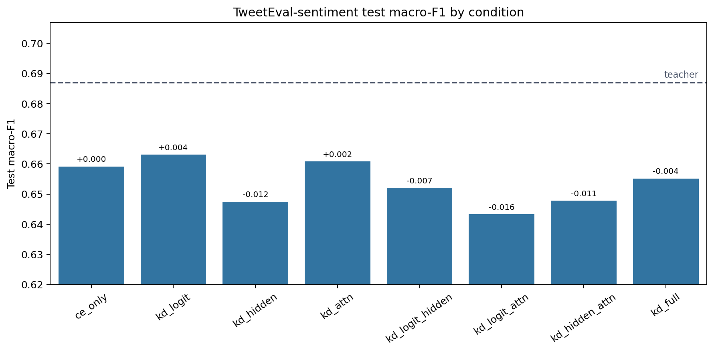
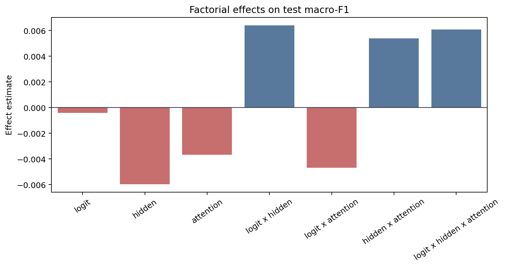
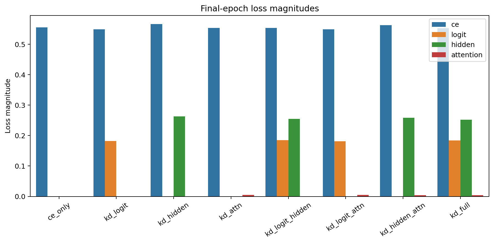
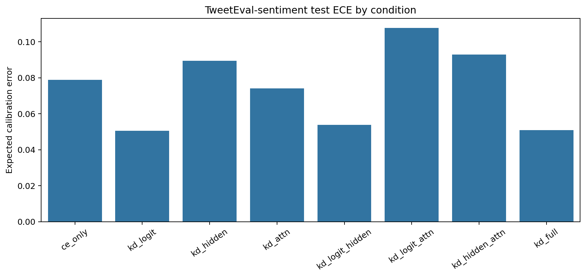

# Factorial Analysis Report

Dataset: `tweet_eval-sentiment`

## Artifact Summary

- Teacher metadata: `results/teachers/tweet_eval-sentiment/run_metadata.json`
- Student metadata: `results/students/tweet_eval-sentiment/*/run_metadata.json`
- Report: `REPORT.md`
- Figures: `results/analysis/figures/`

## Validity Checklist

| Check | Status | Detail |
|---|:---:|---|
| all 8 conditions present and valid | PASS | all 8 condition metadata files are present and valid |
| epochs completed | PASS | all runs completed configured epochs or documented early-stop |
| finite metrics/losses | PASS | all required metrics and active losses are finite |
| teacher forward sane | PASS | top1_agreement is present and above random for every KD condition |
| metric ranges | PASS | F1/accuracy/agreement/ECE values are within [0, 1] |
| artifacts written | PASS | 4 PNG figures and 1 markdown report written |

## Key Results

- Teacher test macro-F1: `0.6870`.
- Best student: `kd_logit` with test macro-F1 `0.6631`.
- CE-only student test macro-F1: `0.6592`.
- Student macro-F1 spread across conditions: `0.0198`.
- Mean final attention-loss magnitude: `0.00453`.

The best pilot student is `kd_logit`, but the full student spread is within
single-seed noise. The factorial effects below should therefore be read as
pipeline diagnostics and descriptive pilot statistics, not resolved causal
estimates.

## Student Ablation Table

Dataset: `tweet_eval-sentiment`

Source files:
`results/teachers/tweet_eval-sentiment/run_metadata.json` and
`results/students/tweet_eval-sentiment/*/run_metadata.json`

Primary metric: test macro-F1. `Delta` is test macro-F1 relative to `ce_only`.
Rows are ordered by test macro-F1 descending.
Bold marks the best value in each metric column: higher is better for F1,
accuracy, and agreement; lower is better for ECE.

| Condition | Logit | Hidden | Attention | Test Macro-F1 | Delta | Test Acc. | Test ECE | Top-1 Agree |
|---|:---:|:---:|:---:|---:|---:|---:|---:|---:|
| `teacher` | N/A | N/A | N/A | **0.6870** | **+0.0278** | **0.6875** | 0.0919 | N/A |
| `kd_logit` | Y |  |  | 0.6631 | +0.0040 | 0.6653 | **0.0506** | **0.7988** |
| `kd_attn` |  |  | Y | 0.6609 | +0.0017 | 0.6596 | 0.0741 | 0.7898 |
| `ce_only` |  |  |  | 0.6592 | +0.0000 | 0.6576 | 0.0789 | 0.7865 |
| `kd_full` | Y | Y | Y | 0.6552 | -0.0039 | 0.6565 | 0.0508 | 0.7910 |
| `kd_logit_hidden` | Y | Y |  | 0.6521 | -0.0071 | 0.6536 | 0.0539 | 0.7905 |
| `kd_hidden_attn` |  | Y | Y | 0.6478 | -0.0113 | 0.6470 | 0.0929 | 0.7774 |
| `kd_hidden` |  | Y |  | 0.6475 | -0.0117 | 0.6468 | 0.0895 | 0.7768 |
| `kd_logit_attn` | Y |  | Y | 0.6433 | -0.0159 | 0.6419 | 0.1077 | 0.7773 |

Best student test macro-F1 is `kd_logit` at 0.6631, +0.0040 over `ce_only`.
The teacher reference is higher at 0.6870.

## Factorial Effects

Metric: `test_macro_f1`

Positive estimates mean the factor or interaction increases the metric under
standard +/-1 factorial coding. Magnitudes are informational for this
single-seed pilot.

| Effect | Kind | Estimate | Absolute |
|---|---:|---:|---:|
| `logit` | main | -0.00041 | 0.00041 |
| `hidden` | main | -0.00596 | 0.00596 |
| `attention` | main | -0.00366 | 0.00366 |
| `logit x hidden` | 2-way | +0.00639 | 0.00639 |
| `logit x attention` | 2-way | -0.00469 | 0.00469 |
| `hidden x attention` | 2-way | +0.00539 | 0.00539 |
| `logit x hidden x attention` | 3-way | +0.00608 | 0.00608 |

## Attention-Loss Caveat

Attention KD used post-softmax attention probabilities in this pilot. Its
final loss magnitude is near-inert compared with CE, logit, and hidden
losses, so the attention factor was only weakly applied. Fix this signal or
explicitly document the caveat before scaling the experiment.

## Figures

### Condition Bars

### Main Effects

### Loss Magnitudes

### Calibration

