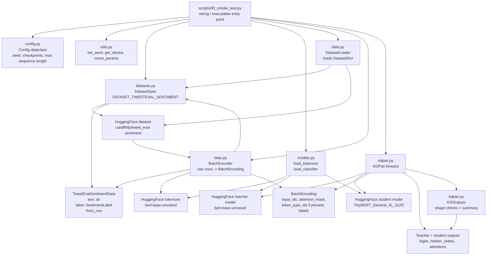
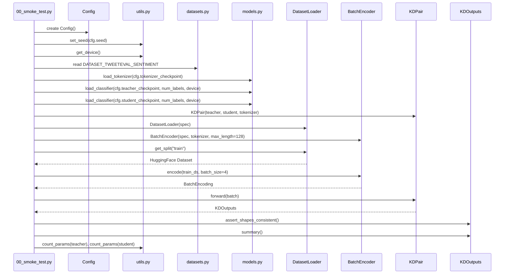
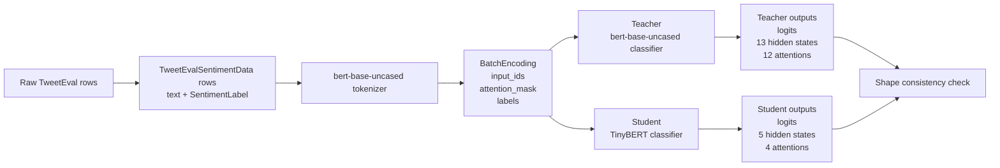

# Current Codebase Concept Diagram

This document describes what the current Iteration 0 codebase does. It is a
foundation and smoke-test layer: it proves that the project can load a teacher,
a student, a tokenizer, and a small dataset batch, then run both models on the
same inputs and inspect their outputs.

It does not yet train anything.

## High-Level Purpose

The current code answers one question:

> Can we wire the TinyBERT-XAI dependencies together correctly before building
> teacher fine-tuning, student training, and KD losses?

The answer is checked by `scripts/00_smoke_test.py`.

## Module Relationship Diagram



## Dependency Direction

The code is intentionally simple and dependency-injection oriented.

The important rule is:

> Construction happens in the script. Core modules receive dependencies as
> arguments instead of creating them secretly.

That means:

- `scripts/00_smoke_test.py` is responsible for wiring the pieces together.
- `models.py` loads models and tokenizers, but does not know about datasets.
- `data.py` loads and tokenizes batches, but does not know about teacher or student models.
- `datasets.py` stores dataset metadata, but does not load models or run training.
- `KDPair` receives already-created teacher, student, and tokenizer objects.
- `KDPair.forward(...)` only runs both models on the same batch.

This keeps responsibilities separated before the training loop becomes more
complex in later iterations.

## Execution Flow



## File Responsibilities

| File | Responsibility | What It Does Not Do |
|---|---|---|
| `src/tinybert_xai/config.py` | Holds basic project settings in `Config`. | Does not load files, models, or datasets. |
| `src/tinybert_xai/datasets.py` | Defines `DatasetSpec`, `SentimentLabel`, `TweetEvalSentimentData`, and `DATASET_TWEETEVAL_SENTIMENT`. | Does not call HuggingFace loading directly. |
| `src/tinybert_xai/models.py` | Loads tokenizer and sequence-classification models. | Does not decide which dataset to use. |
| `src/tinybert_xai/data.py` | `DatasetLoader` loads all HuggingFace splits into a `DatasetDict`; `BatchEncoder` parses rows through `spec.data_cls.from_row`, tokenizes text, adds labels, and returns `BatchEncoding`. | Does not train or evaluate. |
| `src/tinybert_xai/kdpair.py` | Runs teacher and student forward passes on the same batch. | Does not construct models or compute losses. |
| `src/tinybert_xai/utils.py` | Provides generic helpers for seed, device, and parameter counts. | Does not contain project-specific training logic. |
| `scripts/00_smoke_test.py` | Wires all pieces together and checks output shapes. | Does not perform optimization or save checkpoints. |

## Current Data Flow



## Expected Model Output Shapes

For the current smoke test settings:

- Batch size: `4`
- Max sequence length: `128`
- Number of labels: `3` for TweetEval sentiment

Expected teacher outputs:

- Logits: `[4, 3]`
- Hidden states: `13` tensors
  - embedding output plus 12 BERT layers
  - each tensor shaped `[4, 128, 768]`
- Attentions: `12` tensors
  - one per BERT layer
  - each tensor shaped `[4, 12, 128, 128]`

Expected student outputs:

- Logits: `[4, 3]`
- Hidden states: `5` tensors
  - embedding output plus 4 TinyBERT layers
  - each tensor shaped `[4, 128, 312]`
- Attentions: `4` tensors
  - one per TinyBERT layer
  - each tensor shaped `[4, 12, 128, 128]`

These shape differences explain why later iterations need hidden-state
projection layers for KD:

```text
student hidden size: 312
teacher hidden size: 768
needed projection: 312 -> 768
```

## What Exists Now vs. Later

```mermaid
flowchart TD
    Now["Current Iteration 0"]
    Later["Later Iterations"]

    Now --> N1["Load config"]
    Now --> N2["Load dataset spec"]
    Now --> N3["Load tokenizer"]
    Now --> N4["Load teacher + student"]
    Now --> N5["Load one tokenized batch"]
    Now --> N6["Forward both models"]
    Now --> N7["Check output shapes"]

    Later --> L1["Teacher fine-tuning"]
    Later --> L2["Student training loop"]
    Later --> L3["CE loss"]
    Later --> L4["Logit KD loss"]
    Later --> L5["Hidden KD loss"]
    Later --> L6["Attention KD loss"]
    Later --> L7["8-condition factorial sweep"]
    Later --> L8["Evaluation and analysis"]
```



The current codebase is therefore best understood as the dependency skeleton
that later training code will reuse.

## Current Dataset Assumption

`DatasetSpec` intentionally stays small in Iteration 0. It stores:

- HuggingFace dataset path
- optional HuggingFace config name
- row data class

It does not store `text_column` or `label_column`.

The current smoke-test batch loader parses raw rows through:

```python
spec.data_cls.from_row(row)
```

For the pilot dataset, `spec.data_cls` is `TweetEvalSentimentData`:

```python
@dataclass(frozen=True)
class TweetEvalSentimentData:
    text: str
    label: SentimentLabel

    @classmethod
    def from_row(cls, row: dict[str, Any]) -> "TweetEvalSentimentData":
        ...
```

So raw HuggingFace column names are isolated inside the dataset-specific row
class instead of being stored in generic dataset metadata.
