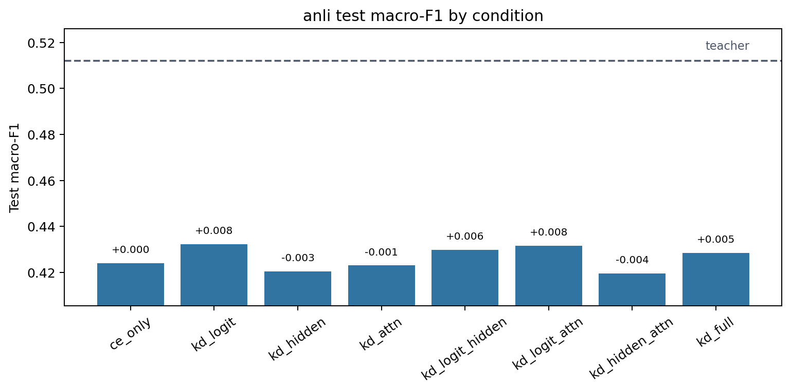
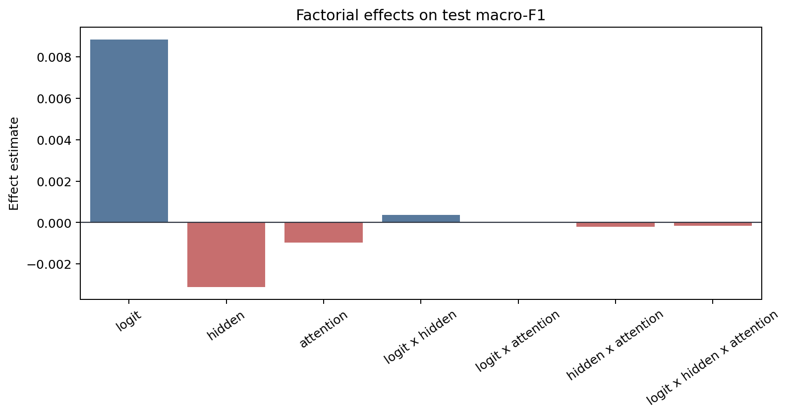
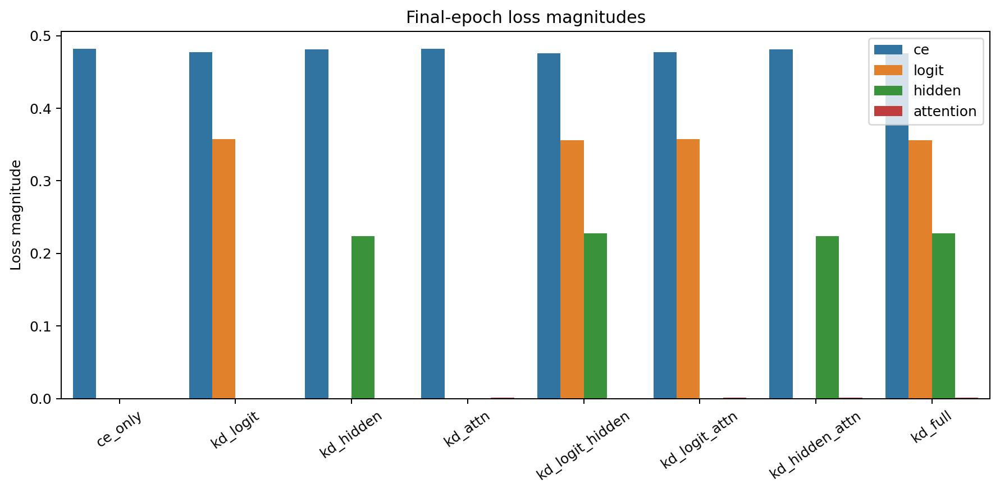
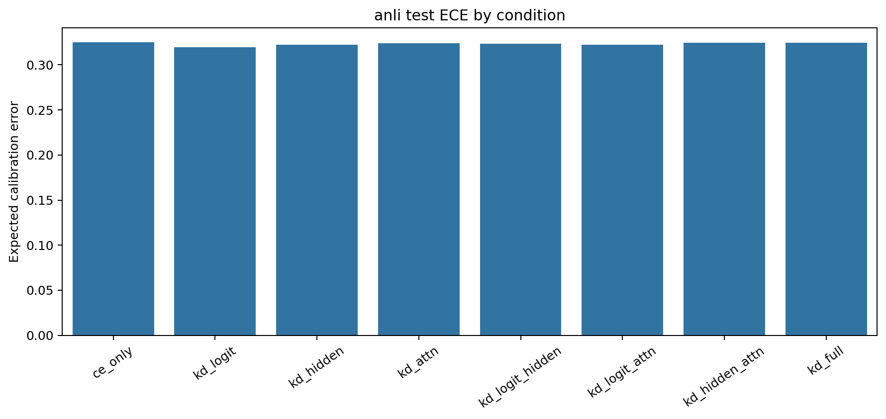

# Factorial Analysis Report

Dataset: `anli`

## Artifact Summary

- Teacher metadata: `results/teachers/anli/run_metadata.json`
- Student metadata: `results/students/anli/*/run_metadata.json`
- Report: `results/analysis/anli/REPORT.md`
- Figures: `figures/`

## Validity Checklist

| Check | Status | Detail |
|---|:---:|---|
| all 8 conditions present and valid | PASS | all 8 condition metadata files are present and valid |
| epochs completed | PASS | all runs completed configured epochs or documented early-stop |
| finite metrics/losses | PASS | all required metrics and active losses are finite |
| teacher forward sane | PASS | top1_agreement is present and above random for every KD condition |
| metric ranges | PASS | F1/accuracy/agreement/ECE values are within [0, 1] |
| artifacts written | PASS | 4 PNG figures and 1 markdown report written |

## Key Results

- Teacher test macro-F1: `0.5121`.
- Best student: `kd_logit` with test macro-F1 `0.4323`.
- CE-only student test macro-F1: `0.4240`.
- Student macro-F1 spread across conditions: `0.0127`.
- Mean final attention-loss magnitude: `0.00123`.

The best student is `kd_logit` (test macro-F1 `0.4323`), but with a single seed the factorial effects
below should be read as pipeline diagnostics and descriptive statistics, not
resolved causal estimates.

## Student Ablation Table

Dataset: `anli`

Source files:
`results/teachers/anli/run_metadata.json` and
`results/students/anli/*/run_metadata.json`

Primary metric: test macro-F1. `Delta` is test macro-F1 relative to `ce_only`.
Rows are ordered by test macro-F1 descending.
Bold marks the best value in each metric column: higher is better for F1,
accuracy, and agreement; lower is better for ECE.

| Condition | Logit | Hidden | Attention | Test Macro-F1 | Delta | Test Acc. | Test ECE | Top-1 Agree |
|---|:---:|:---:|:---:|---:|---:|---:|---:|---:|
| `teacher` | N/A | N/A | N/A | **0.5121** | **+0.0882** | **0.5159** | 0.3267 | N/A |
| `kd_logit` | Y |  |  | 0.4323 | +0.0083 | 0.4403 | **0.3196** | 0.6641 |
| `kd_logit_attn` | Y |  | Y | 0.4317 | +0.0077 | 0.4400 | 0.3221 | 0.6634 |
| `kd_logit_hidden` | Y | Y |  | 0.4299 | +0.0059 | 0.4406 | 0.3235 | **0.6678** |
| `kd_full` | Y | Y | Y | 0.4286 | +0.0046 | 0.4381 | 0.3243 | 0.6628 |
| `ce_only` |  |  |  | 0.4240 | +0.0000 | 0.4316 | 0.3249 | 0.6534 |
| `kd_attn` |  |  | Y | 0.4230 | -0.0009 | 0.4309 | 0.3239 | 0.6519 |
| `kd_hidden` |  | Y |  | 0.4206 | -0.0034 | 0.4328 | 0.3224 | 0.6519 |
| `kd_hidden_attn` |  | Y | Y | 0.4195 | -0.0045 | 0.4316 | 0.3248 | 0.6484 |

Best student test macro-F1 is `kd_logit` at 0.4323, +0.0083 over `ce_only`.
The teacher reference is higher at 0.5121.

## Factorial Effects

Metric: `test_macro_f1`

Positive estimates mean the factor or interaction increases the metric under
standard +/-1 factorial coding. Magnitudes are informational for this
single-seed run.

| Effect | Kind | Estimate | Absolute |
|---|---:|---:|---:|
| `logit` | main | +0.00883 | 0.00883 |
| `hidden` | main | -0.00311 | 0.00311 |
| `attention` | main | -0.00098 | 0.00098 |
| `logit x hidden` | 2-way | +0.00037 | 0.00037 |
| `logit x attention` | 2-way | +0.00001 | 0.00001 |
| `hidden x attention` | 2-way | -0.00022 | 0.00022 |
| `logit x hidden x attention` | 3-way | -0.00017 | 0.00017 |

## Attention-Loss Caveat

Attention KD used post-softmax attention probabilities in this run. Its
final loss magnitude is near-inert compared with CE, logit, and hidden
losses, so the attention factor was only weakly applied. Fix this signal or
explicitly document the caveat before scaling the experiment.

## Figures

### Condition Bars

### Main Effects

### Loss Magnitudes

### Calibration

