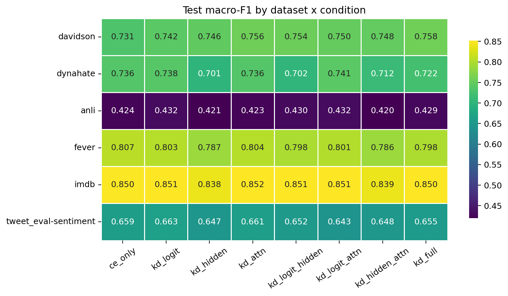
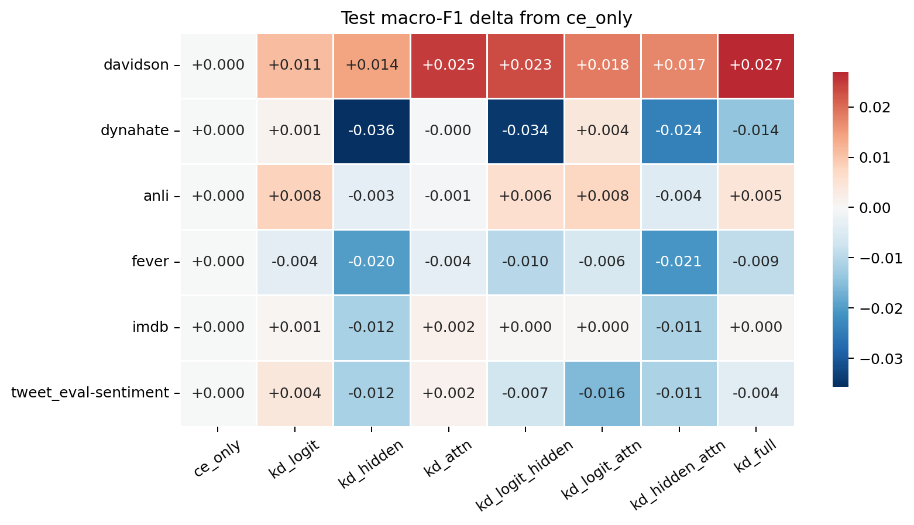
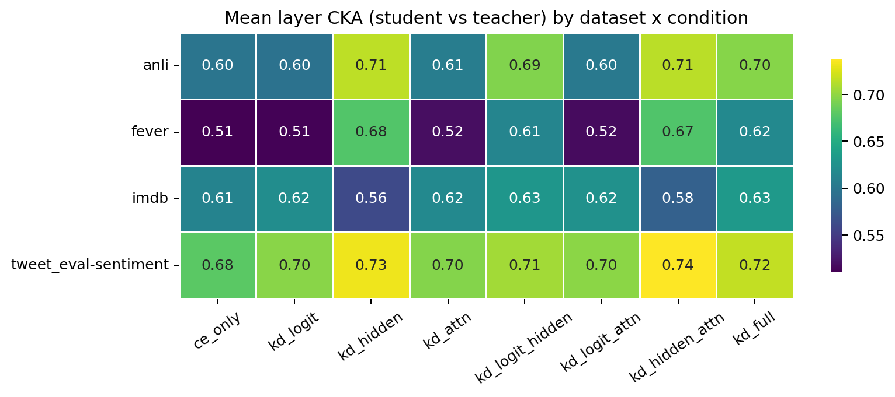
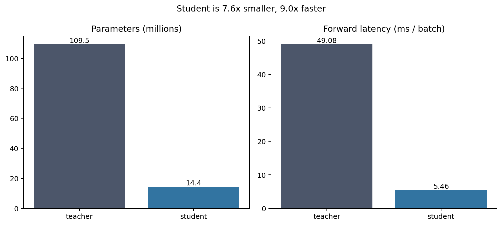

# Cross-Dataset Analysis — Per-Signal KD Ablation

*Iteration 8. Generated artifacts live alongside this file:
`figures/`, `tables/`, and `representation/`.*

## Scope and caveats

- **Accuracy / calibration / factorial analysis:** 6 datasets with complete
  8-condition sweeps — `davidson`, `dynahate` (hate), `anli`, `fever` (NLI),
  `imdb`, `tweet_eval-sentiment` (sentiment).
- **Representation / attention / efficiency analysis:** 4 datasets — `anli`,
  `fever`, `imdb`, `tweet_eval-sentiment`. `davidson` and `dynahate` were
  excluded here because their teacher/student checkpoints were pruned to save
  disk; only their `run_metadata.json` survives.
- **Omitted datasets:** `hateval` (HF-gated, no data), `vardial` (teacher only),
  `multivalue` (not built). Out of scope for iter-8.
- **Single seed (42).** Per-dataset macro-F1 spreads across the 8 conditions are
  ~0.02, i.e. within single-seed noise. **Treat the *signs* of effects as the
  headline, not their magnitudes.** No significance is claimed.
- **Method note (layer similarity).** The trained `HiddenProjection` (312→768)
  weights were never checkpointed, so the design doc's "projected cosine" is not
  reproducible. We substitute **linear CKA** (dimension-agnostic, no projection)
  and report attention-distribution **KL** per mapped pair in place of the
  literal "layer KL".

## Headline: cross-task macro-F1

| dataset | family | teacher | ce_only | best student | KD gain over ce_only |
|---|---|---:|---:|---|---:|
| davidson | hate | 0.750 | 0.731 | `kd_full` 0.758 | +0.027 |
| dynahate | hate | 0.778 | 0.736 | `kd_logit_attn` 0.741 | +0.004 |
| anli | NLI | 0.512 | 0.424 | `kd_logit` 0.432 | +0.008 |
| fever | NLI | 0.810 | 0.807 | `ce_only` 0.807 | +0.000 |
| imdb | sentiment | 0.889 | 0.850 | `kd_attn` 0.852 | +0.002 |
| tweet_eval-sentiment | sentiment | 0.687 | 0.659 | `kd_logit` 0.663 | +0.004 |

The general-distilled TinyBERT checkpoint is already a strong floor: on the
easier tasks the `ce_only` student is within ~0.003 of the teacher (`fever`
0.807 vs 0.810) or a few points short (`imdb` 0.850 vs 0.889). The room KD can
recover is therefore small everywhere except where the student starts far behind
(`davidson` +0.027; `anli` remains far from its 0.512 teacher regardless).

## RQ1 — Which distillation signal carries the gains?

Mean main effect on test macro-F1, averaged over the 6 datasets (standard ±1
factorial coding; positive = the signal raises macro-F1):

| effect | mean estimate |
|---|---:|
| **logit** | **+0.00472** |
| logit × hidden | +0.00416 |
| attention | +0.00208 |
| 3-way | +0.00204 |
| hidden × attention | +0.00115 |
| logit × attention | −0.00093 |
| **hidden** | **−0.00808** |

**Logit KD is the only consistently positive signal** (positive on 5/6 datasets;
only `tweet_eval-sentiment` is marginally negative at −0.0004). **Hidden KD is
consistently negative** (negative on 5/6; positive only on `davidson`), and is
the largest-magnitude main effect. **Attention KD is near-zero**, consistent
with its near-inert post-softmax loss (final-epoch magnitude ~0.005, vs ~0.5 CE).

> **RQ1 answer:** On these tasks the gains ride on the **logit** signal
> (mean main effect +0.0047, positive on 5/6 datasets); **hidden** distillation
> on average *hurts* task macro-F1 (−0.0081), and **attention** is inert
> (+0.0021).

## RQ2 — Is the per-signal contribution stable across task families?

The *signs* are stable across hate, NLI, and sentiment:

- `logit` main effect: anli +0.0088, imdb +0.0058, davidson +0.0058, dynahate
  +0.0044, fever +0.0039, tweet −0.0004 — positive in every family.
- `hidden` main effect: negative in every family except `davidson`
  (dynahate −0.0284, fever −0.0116, imdb −0.0063, tweet −0.0060, anli −0.0031).

Magnitudes are *not* stable and are within single-seed noise — e.g. `hidden`
swings from −0.028 (`dynahate`) to +0.007 (`davidson`). So the cross-task signal
is **directional, not quantitative**: logit helps a little nearly everywhere,
hidden slightly hurts nearly everywhere, with a single seed unable to resolve how
much.

> **RQ2 answer:** Sign-stable, magnitude-unstable. Logit's small positive and
> hidden's small negative contribution hold across all three measured families,
> but single-seed magnitudes vary too much (e.g. hidden −0.028→+0.007) to rank
> families.

## Calibration and error-copying

Per-(dataset, condition) ECE/NLL/Brier are in `tables/calibration.csv`;
teacher-student agreement in `tables/teacher_student.csv`. The recurring pattern:
adding `logit` lowers ECE (the soft targets regularize confidence) while pushing
`top1_agreement` and `error_copying` up — the student increasingly makes the
teacher's *exact* wrong call. This is the expected KD trade-off: better
calibration and teacher mimicry, not necessarily better accuracy.

## Representation similarity (CKA) — similarity ≠ agreement

Linear CKA between student and teacher hidden states (4 datasets), by mapped
pair: `s1-t3` 0.78, `s2-t6` 0.74, `s3-t9` 0.56, `s4-t12` 0.52. **Representations
diverge with depth** — the student's final layer least resembles the teacher's.

Mean CKA by condition exposes the key dissociation:

| group | mean CKA |
|---|---:|
| hidden-bearing (`kd_hidden`, `kd_logit_hidden`, `kd_hidden_attn`, `kd_full`) | ~0.68 |
| no-hidden (`ce_only`, `kd_logit`, `kd_attn`, `kd_logit_attn`) | ~0.62 |

**Hidden KD does exactly what it claims — it makes the student's internal
representations look more like the teacher (CKA 0.68 vs 0.62) — yet that same
signal does not improve, and on average slightly lowers, task macro-F1.** Hidden
similarity is not output agreement. This is the cleanest single finding of the
ablation.

Attention-distribution KL (`representation/attention_kl.csv`) tells the mirror
story: KL(teacher‖student) grows with depth (`s1-t3` 0.13 → `s4-t12` 0.88), so
the deepest attention maps are where teacher and student disagree most — the same
layers where CKA is lowest. Representative attention heatmaps are under
`representation/attention/` (teacher L12 vs student L4, by correctness category).

## Efficiency (teacher vs student)

| model | parameters | forward latency (ms/batch) |
|---|---:|---:|
| teacher (`bert-base-uncased`) | 109.5M | 49.6 |
| student (`TinyBERT_4L_312D`) | 14.4M | 5.5 |

The student is **7.6× smaller and 9.0× faster**, identical across all 8
conditions (architecture is fixed). The ablation is about *which signal recovers
teacher quality into this fixed budget*, and the answer is: logit recovers a
little, hidden does not, attention does nothing — but the dominant fact is that
the general-distilled floor already captures most of the recoverable quality.
