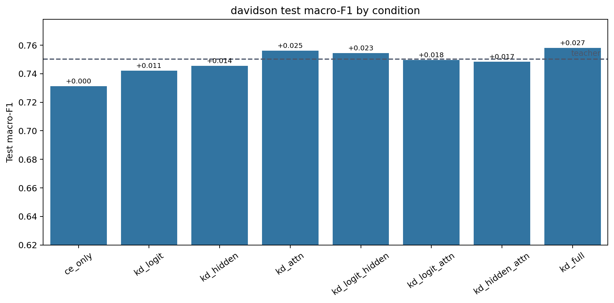
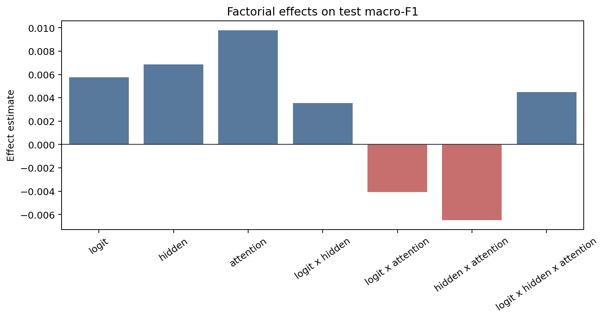
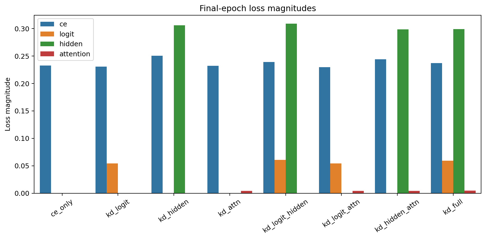
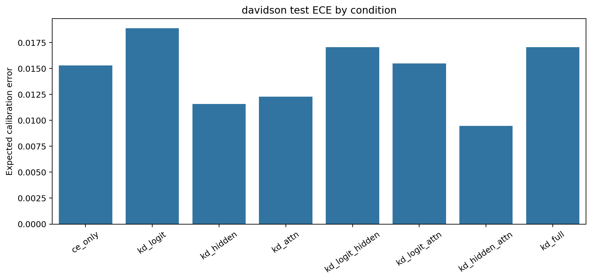

# Factorial Analysis Report

Dataset: `davidson`

## Artifact Summary

- Teacher metadata: `results/teachers/davidson/run_metadata.json`
- Student metadata: `results/students/davidson/*/run_metadata.json`
- Report: `results/analysis/davidson/REPORT.md`
- Figures: `figures/`

## Validity Checklist

| Check | Status | Detail |
|---|:---:|---|
| all 8 conditions present and valid | PASS | all 8 condition metadata files are present and valid |
| epochs completed | PASS | all runs completed configured epochs or documented early-stop |
| finite metrics/losses | PASS | all required metrics and active losses are finite |
| teacher forward sane | PASS | top1_agreement is present and above random for every KD condition |
| metric ranges | PASS | F1/accuracy/agreement/ECE values are within [0, 1] |
| artifacts written | PASS | 4 PNG figures and 1 markdown report written |

## Key Results

- Teacher test macro-F1: `0.7504`.
- Best student: `kd_full` with test macro-F1 `0.7582`.
- CE-only student test macro-F1: `0.7313`.
- Student macro-F1 spread across conditions: `0.0269`.
- Mean final attention-loss magnitude: `0.00433`.

The best student is `kd_full` (test macro-F1 `0.7582`), but with a single seed the factorial effects
below should be read as pipeline diagnostics and descriptive statistics, not
resolved causal estimates.

## Student Ablation Table

Dataset: `davidson`

Source files:
`results/teachers/davidson/run_metadata.json` and
`results/students/davidson/*/run_metadata.json`

Primary metric: test macro-F1. `Delta` is test macro-F1 relative to `ce_only`.
Rows are ordered by test macro-F1 descending.
Bold marks the best value in each metric column: higher is better for F1,
accuracy, and agreement; lower is better for ECE.

| Condition | Logit | Hidden | Attention | Test Macro-F1 | Delta | Test Acc. | Test ECE | Top-1 Agree |
|---|:---:|:---:|:---:|---:|---:|---:|---:|---:|
| `kd_full` | Y | Y | Y | **0.7582** | **+0.0269** | 0.9133 | 0.0170 | **0.9536** |
| `kd_attn` |  |  | Y | 0.7561 | +0.0248 | 0.9121 | 0.0123 | 0.9467 |
| `kd_logit_hidden` | Y | Y |  | 0.7544 | +0.0232 | **0.9149** | 0.0171 | 0.9532 |
| `teacher` | N/A | N/A | N/A | 0.7504 | +0.0192 | 0.9012 | 0.0300 | N/A |
| `kd_logit_attn` | Y |  | Y | 0.7497 | +0.0185 | 0.9129 | 0.0155 | 0.9504 |
| `kd_hidden_attn` |  | Y | Y | 0.7484 | +0.0172 | 0.9121 | **0.0095** | 0.9423 |
| `kd_hidden` |  | Y |  | 0.7456 | +0.0143 | 0.9109 | 0.0116 | 0.9383 |
| `kd_logit` | Y |  |  | 0.7420 | +0.0108 | 0.9088 | 0.0189 | 0.9516 |
| `ce_only` |  |  |  | 0.7313 | +0.0000 | 0.9068 | 0.0153 | 0.9427 |

Best student test macro-F1 is `kd_full` at 0.7582, +0.0269 over `ce_only`.
The teacher reference is higher at 0.7504.

## Factorial Effects

Metric: `test_macro_f1`

Positive estimates mean the factor or interaction increases the metric under
standard +/-1 factorial coding. Magnitudes are informational for this
single-seed run.

| Effect | Kind | Estimate | Absolute |
|---|---:|---:|---:|
| `logit` | main | +0.00577 | 0.00577 |
| `hidden` | main | +0.00688 | 0.00688 |
| `attention` | main | +0.00977 | 0.00977 |
| `logit x hidden` | 2-way | +0.00354 | 0.00354 |
| `logit x attention` | 2-way | -0.00407 | 0.00407 |
| `hidden x attention` | 2-way | -0.00646 | 0.00646 |
| `logit x hidden x attention` | 3-way | +0.00449 | 0.00449 |

## Attention-Loss Caveat

Attention KD used post-softmax attention probabilities in this run. Its
final loss magnitude is near-inert compared with CE, logit, and hidden
losses, so the attention factor was only weakly applied. Fix this signal or
explicitly document the caveat before scaling the experiment.

## Figures

### Condition Bars

### Main Effects

### Loss Magnitudes

### Calibration

