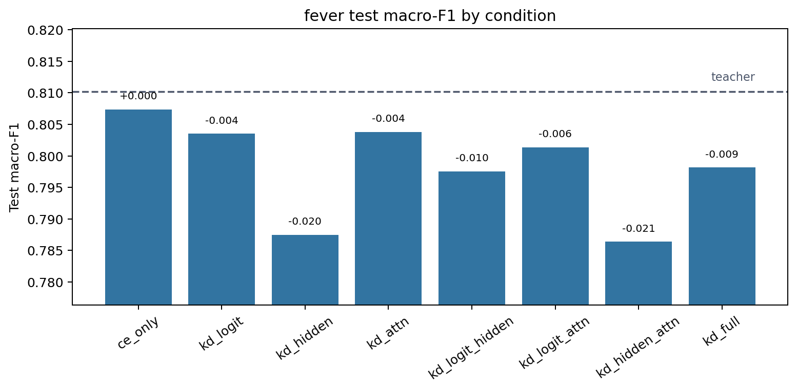
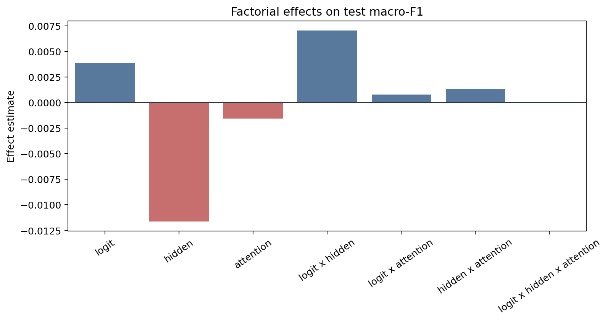
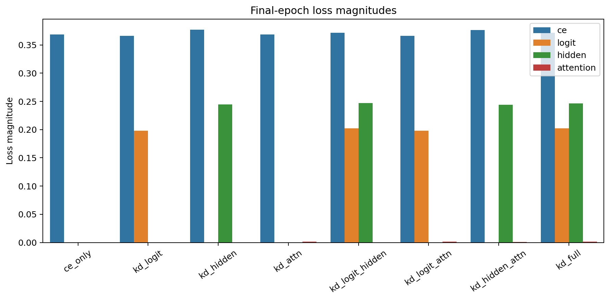
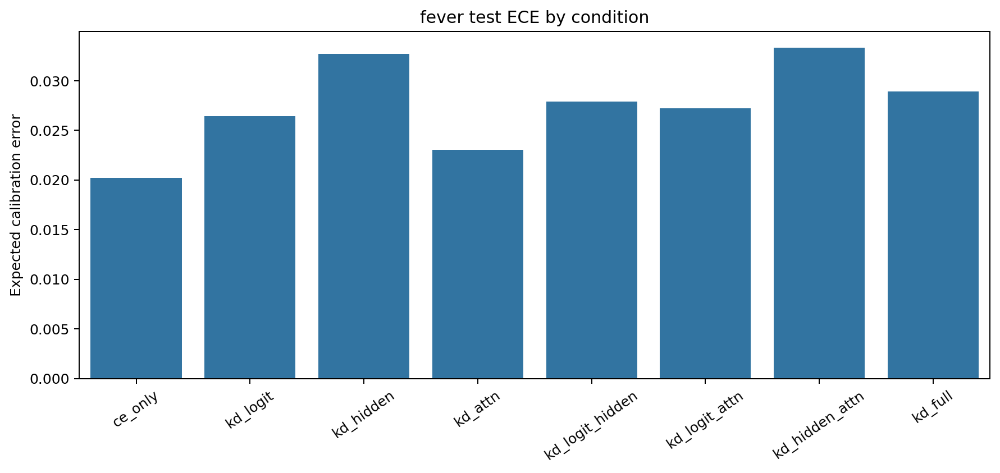

# Factorial Analysis Report

Dataset: `fever`

## Artifact Summary

- Teacher metadata: `results/teachers/fever/run_metadata.json`
- Student metadata: `results/students/fever/*/run_metadata.json`
- Report: `results/analysis/fever/REPORT.md`
- Figures: `figures/`

## Validity Checklist

| Check | Status | Detail |
|---|:---:|---|
| all 8 conditions present and valid | PASS | all 8 condition metadata files are present and valid |
| epochs completed | PASS | all runs completed configured epochs or documented early-stop |
| finite metrics/losses | PASS | all required metrics and active losses are finite |
| teacher forward sane | PASS | top1_agreement is present and above random for every KD condition |
| metric ranges | PASS | F1/accuracy/agreement/ECE values are within [0, 1] |
| artifacts written | PASS | 4 PNG figures and 1 markdown report written |

## Key Results

- Teacher test macro-F1: `0.8102`.
- Best student: `ce_only` with test macro-F1 `0.8074`.
- CE-only student test macro-F1: `0.8074`.
- Student macro-F1 spread across conditions: `0.0210`.
- Mean final attention-loss magnitude: `0.00131`.

The best student is `ce_only` (test macro-F1 `0.8074`), but with a single seed the factorial effects
below should be read as pipeline diagnostics and descriptive statistics, not
resolved causal estimates.

## Student Ablation Table

Dataset: `fever`

Source files:
`results/teachers/fever/run_metadata.json` and
`results/students/fever/*/run_metadata.json`

Primary metric: test macro-F1. `Delta` is test macro-F1 relative to `ce_only`.
Rows are ordered by test macro-F1 descending.
Bold marks the best value in each metric column: higher is better for F1,
accuracy, and agreement; lower is better for ECE.

| Condition | Logit | Hidden | Attention | Test Macro-F1 | Delta | Test Acc. | Test ECE | Top-1 Agree |
|---|:---:|:---:|:---:|---:|---:|---:|---:|---:|
| `teacher` | N/A | N/A | N/A | **0.8102** | **+0.0029** | **0.8674** | 0.0534 | N/A |
| `ce_only` |  |  |  | 0.8074 | +0.0000 | 0.8630 | **0.0202** | 0.9104 |
| `kd_attn` |  |  | Y | 0.8038 | -0.0036 | 0.8606 | 0.0230 | 0.9110 |
| `kd_logit` | Y |  |  | 0.8035 | -0.0039 | 0.8620 | 0.0264 | 0.9114 |
| `kd_logit_attn` | Y |  | Y | 0.8014 | -0.0060 | 0.8602 | 0.0272 | **0.9120** |
| `kd_full` | Y | Y | Y | 0.7981 | -0.0092 | 0.8584 | 0.0289 | 0.9106 |
| `kd_logit_hidden` | Y | Y |  | 0.7975 | -0.0098 | 0.8580 | 0.0279 | 0.9100 |
| `kd_hidden` |  | Y |  | 0.7875 | -0.0199 | 0.8510 | 0.0327 | 0.9064 |
| `kd_hidden_attn` |  | Y | Y | 0.7864 | -0.0210 | 0.8508 | 0.0333 | 0.9076 |

Best student test macro-F1 is `ce_only` at 0.8074, +0.0000 over `ce_only`.
The teacher reference is higher at 0.8102.

## Factorial Effects

Metric: `test_macro_f1`

Positive estimates mean the factor or interaction increases the metric under
standard +/-1 factorial coding. Magnitudes are informational for this
single-seed run.

| Effect | Kind | Estimate | Absolute |
|---|---:|---:|---:|
| `logit` | main | +0.00389 | 0.00389 |
| `hidden` | main | -0.01161 | 0.01161 |
| `attention` | main | -0.00156 | 0.00156 |
| `logit x hidden` | 2-way | +0.00703 | 0.00703 |
| `logit x attention` | 2-way | +0.00078 | 0.00078 |
| `hidden x attention` | 2-way | +0.00130 | 0.00130 |
| `logit x hidden x attention` | 3-way | +0.00007 | 0.00007 |

## Attention-Loss Caveat

Attention KD used post-softmax attention probabilities in this run. Its
final loss magnitude is near-inert compared with CE, logit, and hidden
losses, so the attention factor was only weakly applied. Fix this signal or
explicitly document the caveat before scaling the experiment.

## Figures

### Condition Bars

### Main Effects

### Loss Magnitudes

### Calibration

