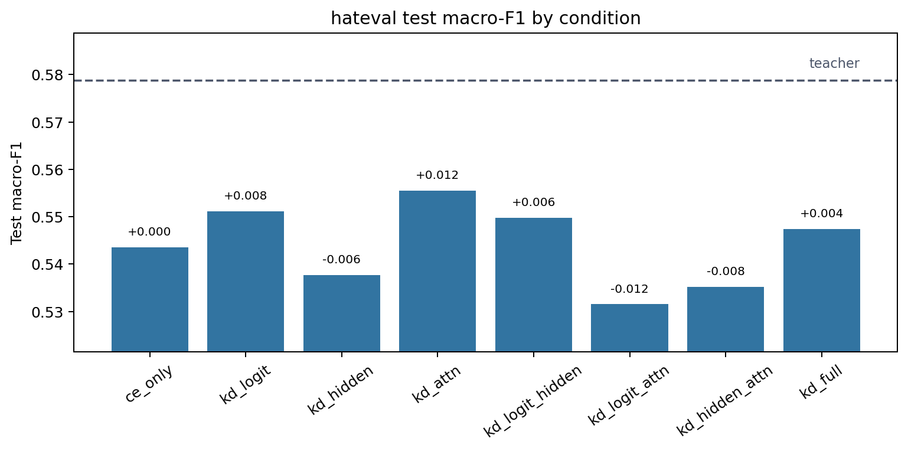
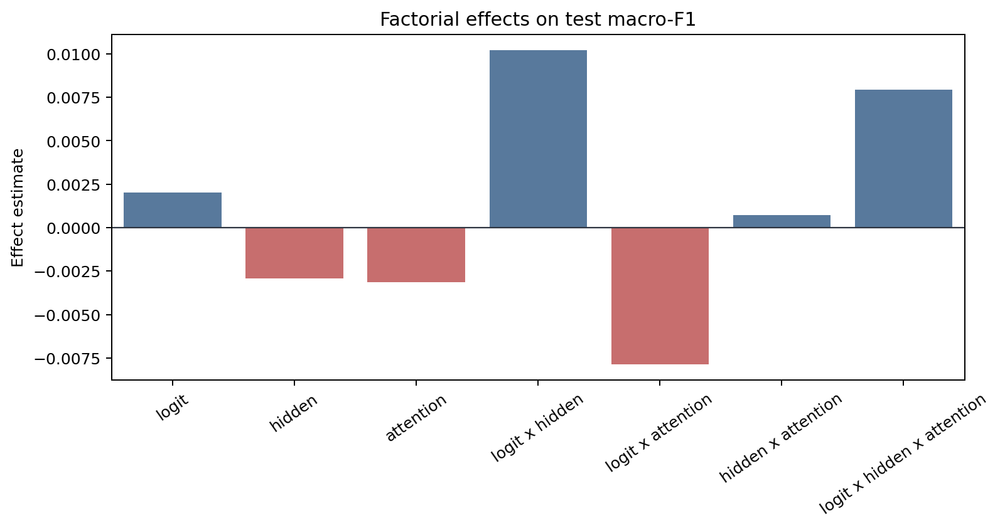
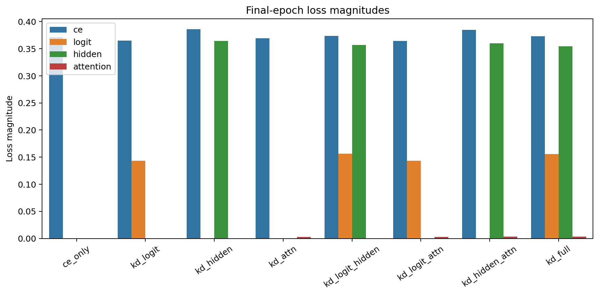
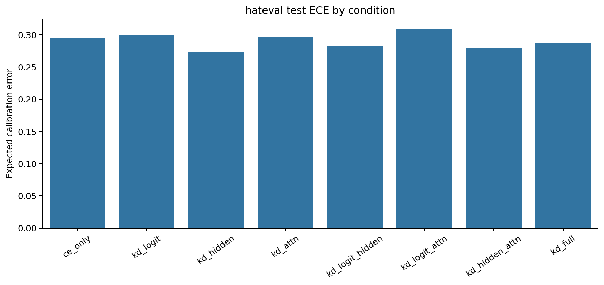

# Factorial Analysis Report

Dataset: `hateval`

## Artifact Summary

- Teacher metadata: `results/teachers/hateval/run_metadata.json`
- Student metadata: `results/students/hateval/*/run_metadata.json`
- Report: `results/analysis/hateval/REPORT.md`
- Figures: `figures/`

## Validity Checklist

| Check | Status | Detail |
|---|:---:|---|
| all 8 conditions present and valid | PASS | all 8 condition metadata files are present and valid |
| epochs completed | PASS | all runs completed configured epochs or documented early-stop |
| finite metrics/losses | PASS | all required metrics and active losses are finite |
| teacher forward sane | PASS | top1_agreement is present and above random for every KD condition |
| metric ranges | PASS | F1/accuracy/agreement/ECE values are within [0, 1] |
| artifacts written | PASS | 4 PNG figures and 1 markdown report written |

## Key Results

- Teacher test macro-F1: `0.5788`.
- Best student: `kd_attn` with test macro-F1 `0.5555`.
- CE-only student test macro-F1: `0.5436`.
- Student macro-F1 spread across conditions: `0.0240`.
- Mean final attention-loss magnitude: `0.00331`.

The best student is `kd_attn` (test macro-F1 `0.5555`), but with a single seed the factorial effects
below should be read as pipeline diagnostics and descriptive statistics, not
resolved causal estimates.

## Student Ablation Table

Dataset: `hateval`

Source files:
`results/teachers/hateval/run_metadata.json` and
`results/students/hateval/*/run_metadata.json`

Primary metric: test macro-F1. `Delta` is test macro-F1 relative to `ce_only`.
Rows are ordered by test macro-F1 descending.
Bold marks the best value in each metric column: higher is better for F1,
accuracy, and agreement; lower is better for ECE.

| Condition | Logit | Hidden | Attention | Test Macro-F1 | Delta | Test Acc. | Test ECE | Top-1 Agree |
|---|:---:|:---:|:---:|---:|---:|---:|---:|---:|
| `teacher` | N/A | N/A | N/A | **0.5788** | **+0.0353** | **0.5917** | 0.3034 | N/A |
| `kd_attn` |  |  | Y | 0.5555 | +0.0119 | 0.5683 | 0.2971 | 0.8799 |
| `kd_logit` | Y |  |  | 0.5512 | +0.0076 | 0.5650 | 0.2993 | **0.8888** |
| `kd_logit_hidden` | Y | Y |  | 0.5498 | +0.0062 | 0.5608 | 0.2822 | 0.8659 |
| `kd_full` | Y | Y | Y | 0.5474 | +0.0039 | 0.5591 | 0.2877 | 0.8702 |
| `ce_only` |  |  |  | 0.5436 | +0.0000 | 0.5541 | 0.2961 | 0.8586 |
| `kd_hidden` |  | Y |  | 0.5377 | -0.0059 | 0.5508 | **0.2733** | 0.8470 |
| `kd_hidden_attn` |  | Y | Y | 0.5352 | -0.0084 | 0.5490 | 0.2799 | 0.8492 |
| `kd_logit_attn` | Y |  | Y | 0.5315 | -0.0121 | 0.5490 | 0.3094 | 0.8847 |

Best student test macro-F1 is `kd_attn` at 0.5555, +0.0119 over `ce_only`.
The teacher reference is higher at 0.5788.

## Factorial Effects

Metric: `test_macro_f1`

Positive estimates mean the factor or interaction increases the metric under
standard +/-1 factorial coding. Magnitudes are informational for this
single-seed run.

| Effect | Kind | Estimate | Absolute |
|---|---:|---:|---:|
| `logit` | main | +0.00201 | 0.00201 |
| `hidden` | main | -0.00292 | 0.00292 |
| `attention` | main | -0.00316 | 0.00316 |
| `logit x hidden` | 2-way | +0.01020 | 0.01020 |
| `logit x attention` | 2-way | -0.00785 | 0.00785 |
| `hidden x attention` | 2-way | +0.00071 | 0.00071 |
| `logit x hidden x attention` | 3-way | +0.00793 | 0.00793 |

## Attention-Loss Caveat

Attention KD used post-softmax attention probabilities in this run. Its
final loss magnitude is near-inert compared with CE, logit, and hidden
losses, so the attention factor was only weakly applied. Fix this signal or
explicitly document the caveat before scaling the experiment.

## Figures

### Condition Bars

### Main Effects

### Loss Magnitudes

### Calibration

