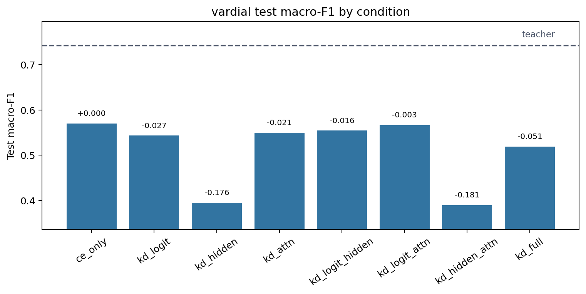
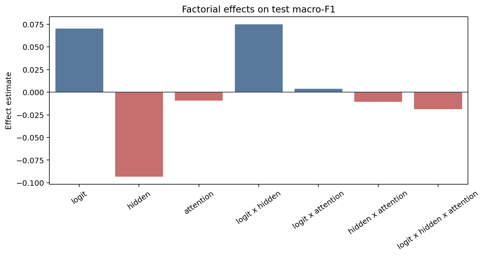
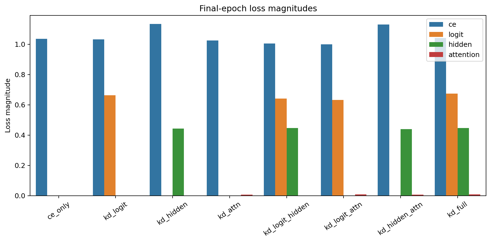
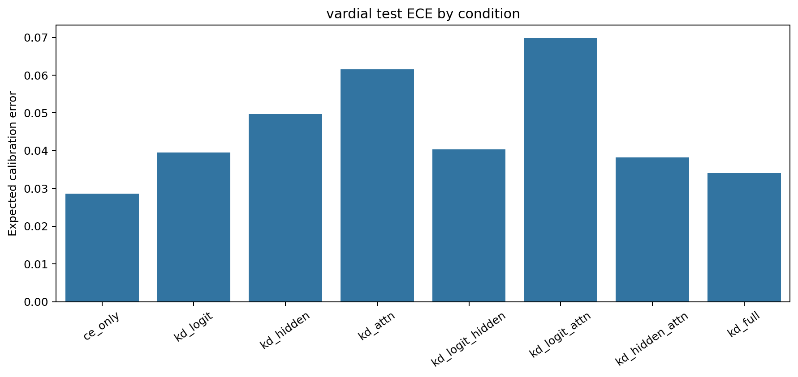

# Factorial Analysis Report

Dataset: `vardial`

## Artifact Summary

- Teacher metadata: `results/teachers/vardial/run_metadata.json`
- Student metadata: `results/students/vardial/*/run_metadata.json`
- Report: `results/analysis/vardial/REPORT.md`
- Figures: `figures/`

## Validity Checklist

| Check | Status | Detail |
|---|:---:|---|
| all 8 conditions present and valid | PASS | all 8 condition metadata files are present and valid |
| epochs completed | PASS | all runs completed configured epochs or documented early-stop |
| finite metrics/losses | PASS | all required metrics and active losses are finite |
| teacher forward sane | PASS | top1_agreement is present and above random for every KD condition |
| metric ranges | PASS | F1/accuracy/agreement/ECE values are within [0, 1] |
| artifacts written | PASS | 4 PNG figures and 1 markdown report written |

## Key Results

- Teacher test macro-F1: `0.7430`.
- Best student: `ce_only` with test macro-F1 `0.5702`.
- CE-only student test macro-F1: `0.5702`.
- Student macro-F1 spread across conditions: `0.1810`.
- Mean final attention-loss magnitude: `0.00712`.

The best student is `ce_only` (test macro-F1 `0.5702`), but with a single seed the factorial effects
below should be read as pipeline diagnostics and descriptive statistics, not
resolved causal estimates.

## Student Ablation Table

Dataset: `vardial`

Source files:
`results/teachers/vardial/run_metadata.json` and
`results/students/vardial/*/run_metadata.json`

Primary metric: test macro-F1. `Delta` is test macro-F1 relative to `ce_only`.
Rows are ordered by test macro-F1 descending.
Bold marks the best value in each metric column: higher is better for F1,
accuracy, and agreement; lower is better for ECE.

| Condition | Logit | Hidden | Attention | Test Macro-F1 | Delta | Test Acc. | Test ECE | Top-1 Agree |
|---|:---:|:---:|:---:|---:|---:|---:|---:|---:|
| `teacher` | N/A | N/A | N/A | **0.7430** | **+0.1728** | **0.7432** | 0.0981 | N/A |
| `ce_only` |  |  |  | 0.5702 | +0.0000 | 0.5726 | **0.0286** | 0.6337 |
| `kd_logit_attn` | Y |  | Y | 0.5670 | -0.0032 | 0.5768 | 0.0698 | **0.6358** |
| `kd_logit_hidden` | Y | Y |  | 0.5544 | -0.0158 | 0.5621 | 0.0403 | 0.6063 |
| `kd_attn` |  |  | Y | 0.5494 | -0.0208 | 0.5579 | 0.0616 | 0.6105 |
| `kd_logit` | Y |  |  | 0.5433 | -0.0269 | 0.5516 | 0.0394 | 0.6042 |
| `kd_full` | Y | Y | Y | 0.5192 | -0.0510 | 0.5326 | 0.0340 | 0.5684 |
| `kd_hidden` |  | Y |  | 0.3944 | -0.1758 | 0.4189 | 0.0496 | 0.4421 |
| `kd_hidden_attn` |  | Y | Y | 0.3892 | -0.1810 | 0.4210 | 0.0382 | 0.4568 |

Best student test macro-F1 is `ce_only` at 0.5702, +0.0000 over `ce_only`.
The teacher reference is higher at 0.7430.

## Factorial Effects

Metric: `test_macro_f1`

Positive estimates mean the factor or interaction increases the metric under
standard +/-1 factorial coding. Magnitudes are informational for this
single-seed run.

| Effect | Kind | Estimate | Absolute |
|---|---:|---:|---:|
| `logit` | main | +0.07018 | 0.07018 |
| `hidden` | main | -0.09314 | 0.09314 |
| `attention` | main | -0.00939 | 0.00939 |
| `logit x hidden` | 2-way | +0.07483 | 0.07483 |
| `logit x attention` | 2-way | +0.00365 | 0.00365 |
| `hidden x attention` | 2-way | -0.01082 | 0.01082 |
| `logit x hidden x attention` | 3-way | -0.01862 | 0.01862 |

## Attention-Loss Caveat

Attention KD used post-softmax attention probabilities in this run. Its
final loss magnitude is near-inert compared with CE, logit, and hidden
losses, so the attention factor was only weakly applied. Fix this signal or
explicitly document the caveat before scaling the experiment.

## Figures

### Condition Bars

### Main Effects

### Loss Magnitudes

### Calibration

